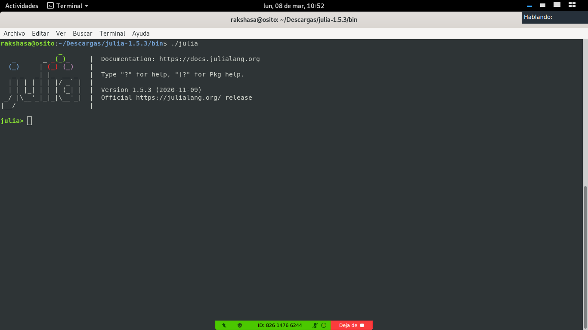

# Instalación de `Julia`

1. Descargar la versión Julia v1.5.3 (2020-11-09) para la plataforma en la que trabajen, de [aquí](https://julialang.org/downloads/) e instalarlo. Sean especialmente cuidadosos en escoger la versión apropiada (32 o 64 bits); computadoras relativamente modernas usan 64 bits. Sugiero instalar la versión a partir de los binarios.

2. Correr el ejecutable de `Julia` que instalaron; el lugar donde se encuentra el ejecutable depende de la plataforma que usen. Esto debería abrir una nueva ventana con el *prompt* `julia> `; esta ventana también se conoce como REPL ("Read-Evaluate-Print-Loop").

   

   `Julia` puede ser usado desde la terminal (REPL), usando el Jupyter notebook (o JupyterLab), o usando distintos editores que permiten correr Julia ahí mismo (ver [Julia Editor Support](https://github.com/JuliaEditorSupport)).

3. Para usar `Julia` desde el Jupyter notebook, se requiere instalar el paquete [`IJulia`](https://github.com/JuliaLang/IJulia.jl); instalaremos además los paqueter [`Plots`](https://github.com/JuliaPlots/Plots.jl) y [`Literate`](https://github.com/fredrikekre/Literate.jl). Para esto, desde Julia (en el REPL), al apretar la tecla `]` se abrirá el manejador de paqueterías de Julia, lo que se aprecia a través del prompt `(v1.5) pkg> `.

   Dentro del manejador de paquetes, agregaremos las paqueterías usando el comando:
	```
		$ julia
		(v1.5) pkg> add IJulia

		(v1.5) pkg> build IJulia

		(v1.5) pkg> add Literate Plots
	```

4. Iniciar el "Jupyter notebook": Regresamos ahora a la línea de comandos de
Julia (prompt `julia> `) usando la tecla para borrar o apretando `ctrl-C`. Para
empezar a usar el notebook, correremos los siguientes comandos:
	```
	        julia> using IJulia
			julia> notebook()
	```

   A partir de aquí, uno puede ejecutar los comandos escritos en las celdas usando `shift-enter`.
